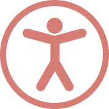

<div align="center">
    
    <h1>React Access Hooks</h1>
</div>

React hooks library for simplifying the implementation of accessible React components.


## The why
Accessibility is very important, yet it is one of many aspects the developer needs to worry about when developing a website.

This package tries to simplify the way to implement accessible UI. It helps doing that by organizing and abstracting the logic and thus making your code more readable, but still giving you control.

# Installation
```
# npm
npm i react-access-hooks

# yarn 
yarn add react-access-hooks
```

# Usage
Currently the package include these hooks:
- `useKeyboardAction` executes a callback when key is pressed.
- `useOutsideClick` executes a callback when clicking outside an element.
- `useFocusTrap` traps the focus inside an element.


## useKeyboardAction
| Name         | Default | Description                                                                                                                                                                                                                                                                                                   |
| ------------ | ------- | ------------------------------------------------------------------------------------------------------------------------------------------------------------------------------------------------------------------------------------------------------------------------------------------------------------- |
| key          | N/A     | [Key Code](https://developer.mozilla.org/en-US/docs/Web/API/KeyboardEvent/key/Key_Values) e.g. Enter, Space, ArrowUp. When the key is pressed the `action` function will be executed.  If key is set to `printable`, printable keys (characters) will be passed to the `action` callback as second argument. |
| action       | N/A     | A callback to be executed when `key` is pressed. The first argument is the Keyboard event object. If the `key` is set to `printable`, the second argument is set to the passed characters.                                                                                                                   |
| condition    | true    | The callback can be executed only if the condition is [truthy](https://developer.mozilla.org/en-US/docs/Glossary/Truthy).                                                                                                                                                                                                                                                    |
| target       | N/A  | The element (target), the event listener will be added to.                                                                                                                                                                                                                                                    |
| clearTimeout | 750     | Milliseconds for the printable keys (characters) to be cleared                                                                                                                                                                                                                                               |

### Basic example
```jsx
function App () {
    // ...
    
    useKeyboardAction({
        key: "ArrowDown",
        condition: open,
        action: (ev) => selectNextItem(),
        target: ListRef.current,
    });

    // Return some JSX
}
```

When `ArrowDown` key is pressed while `target` element is in focus and `condition` is met, the `action` callback will be executed.

### Multiple keys
```jsx
function App () {
    // ...
    
    useKeyboardAction({
        key: ["keyA", "keyB"],
        action: (ev) => callback(),
    });

    // Return some JSX
}
```
Whenever `keyA`  or `keyB` are pressed, the `action` callback will be executed.


### Printable keys
```jsx
const items = ["Foo", "Bar", "Baz", "Qux", "Quux"]

function App () {
    // ...
    
    useKeyboardAction({
        key: "printable",
        clearTimeout: 500,
        action: (_, keysSoFar) => {
            const index = items.findIndex((item) => keysSoFar.toLowerCase() === item.toLowerCase());
            if (index !== -1) setActiveItem(index);
        },
    });

    // Return some JSX
}
```
Whenever printable keys (character) are pressed in interval within 500 milliseconds, the `action` callback will be called with string of the pressed keys in the second argument. 

## useOutsideClick
The `useOutsideClick` hook is more simple. The hooks detects clicks outside of an element then execute your callback.

The hook takes three props:
- `element` is HTML element reference.
- `condition` is a boolean for when the hook should be mounted (activated).
- `action` is a callback which get executed when a click is initiated outside of the `element`. MouseEvent object is passed as first argument to the callback.


```jsx
function App () {
    // ...
    const [open, setOpen] = useState(false);
    const ListboxRef = useRef(null);

    useOutsideClick({ element: ListboxRef, action: (ev) => setOpen(false), condition: open });

    // Return some JSX
}
```
## useFocusTrap
The `useFocusTrap` hook is useful for implementing things like dialogs or a date pickers since they often require trapping the focus inside the container element when a active.


### useFocusTrap usage example:

```jsx
function App () {
    // ...
    const DialogRef = useRef(null);
    const TextareaRef = useRef(null);

    useFocusTrap({element: DialogRef, condition: open, initialFocus: TextareaRef});

    // Return some JSX
}
```

- `element` is HTML element reference for the focus trap container.
- `condition` is boolean which determine when focus trap is active.
- `initialFocus` is reference for an element to be focused when the focus trap is active. If this option is not set, the first focusable element will be used instead.


**Note:** when focus trap is deactivated the focus will return to the last element before focus trap was activated.

## More examples
For more examples check the [samples directory](https://github.com/hamzakhuswan/react-access-hooks/tree/main/samples) in the Github repo. 


--------
Made by [HamzaKhuswan](https://hamzakhuswan.com) \
Licensed under MIT license